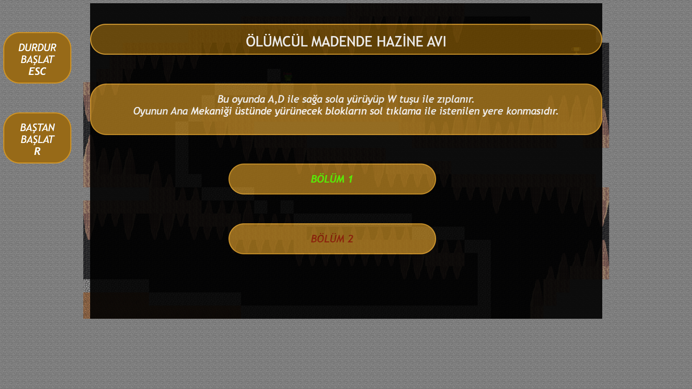
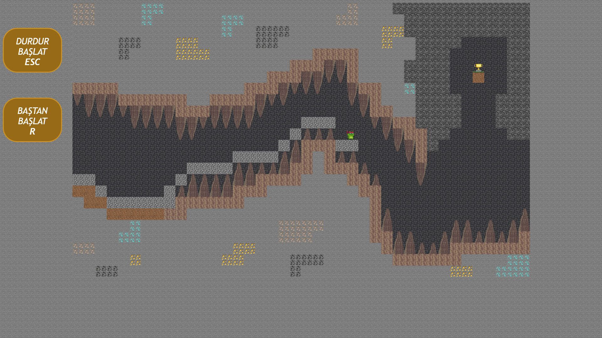
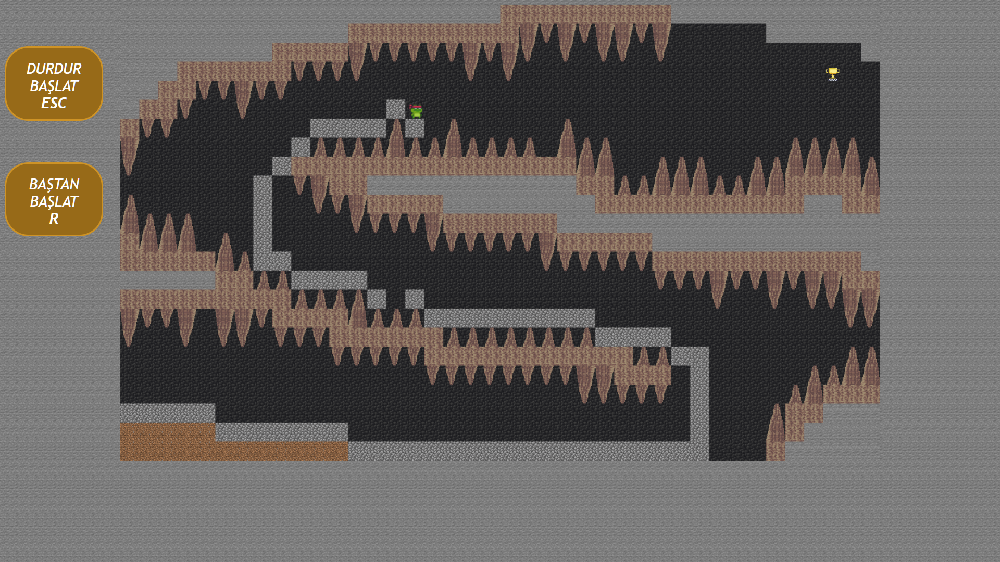

# Web Tabanlı Programlama JavaScript Oyun Projesi

## Oynama Linki
[Oyun Linki](https://mustafaaykut77.github.io/WebTabanliProgramlamaProje01/)

## Oynanış Videosu
örnek

## Ana Fikir

* Oyunumdaki amaç 2D bir haritada altın kupa hedefine ulaşarak oyunu kazanmaktır.
* Karakter haritada konumlandırılmış dikenlere çarptığında oyun karakteri ölür ve karakter 		  başlangıç konumuna ışınlanır.
* Oyunun ana mekaniği oyuncunun üstünde yürüyeceği blokları sol tıklama ile boş bir yere koyup üstünde yürüyerek hedefe ulaşmasıdır.

## Oyuna İlk Girildiğinde Yapılması Gerekenler
Oyuna ilk girildiğinde Sahne 1 veya Sahne 2'lerden bir tanesi seçilir. Oyun artık oynanabilir olur. Bu bölümden diğer bölüme istenilen bir zamanda ESC veya soldaki tuştan oyunu durdurup geçilebilir.

## Kontroller

### Yürüme:
* A,D tuşları ile yürünür W ile zıplanır.
### Blok Koyma:
* Sol tıklama ile blok konur.
### Durdurma:
* ESC tuşu veya soldaki menü ile oyun durdurulur.
### Baştan başlatma:
* R tuşu veya soldaki menü ile oyun baştan başlatılır.

## Oyundan bazı görseller
### Menü
### 
### Bölüm 1
### 
### Bölüm 2
### 

## Projeyi Yapan
Mustafa AYKUT

## Special Thanks To
Eren GÜRELİ, Eren KÖSE

